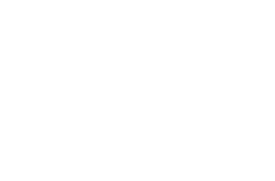

<div style='margin-left:200px; margin-bottom:40px'>

</div>

Welcome to the Archetype Gitpod environement. It comes with the following installed packages:
* Archetype 1.2.2
* Archetype VS Code [extension](https://marketplace.visualstudio.com/items?itemName=edukera.archetype)
* [Completium CLI](https://completium.com/docs/dapp-tools/completium-cli)
* Tezos client
* Taquito

You can developp, deploy, call and test a smart contract on the Tezos blockchain.

## Archetype tutorial

The `tutorial` directory provides 8 basic exercises to discover Archetype:

|  | File | Description |
| -- | -- | :-- |
| 1 | [Hello Tezos world](./tutorial/1-hello.arl) | Write and deploy your first contract |
| 2 | [Execution conditions](./tutorial/2-exec_conditions.arl) | Syntax to establish business rules to execute an entry point |
| 3 | [Rational and transfer](./tutorial/3-rat_transfer.arl) | Use `rational` type for business formula |
| 4 | [Date and duration](./tutorial/4-time_window.arl) | Use `duration` to establish time based execution conditions
| 5 | [Dates arithmetic](./tutorial/5-weekday.arl) | Compute day of the week from date
| 6 | [State machine](./tutorial/6-state_machine.arl) | Improve your contract's design with state machines |
| 7 | [Assets](./tutorial/7-assets) | Benefit from rich storage API
| 8 | [Call a contract](./tutorial/8-2-contract-caller.arl) | Learn how to retreive data from a [called contract](./tutorial/8-1-contract_called) |

## Completium CLI

Completium CLI is a command line on top of Archetype and Tezos client to interact with Archetype contracts.

You can use completium in VS Code in the Terminal (Menu Terminal/New Terminal).

> The Gipod environment comes with an account already registered, named `admin` at address `tz1MZrh8CvYkp7BfLQMcm6mg5FvL5HRZfACw`

Show registered accounts

```
$ completium-cli show accounts:
```

You may want to register your own test account with a [faucet](https://faucet.tzalpha.net/) file:

`$ completium-cli generate account <ACCOUNT_NAME> --from-faucet <FAUCET_FILE>`

It is *strongly* advised to develop and test on the test network. Check you are interacting with the test network with:

`$ completium-cli show endpoint`

Deploy a contract:

`$ completium-cli deploy <FILE.arl>`

The entire list of commands is available [here](https://completium.com/docs/dapp-tools/completium-cli).

Deploy a contract

## Archetype VS Code extension

Archetype VS Code extension provides the following VS code commands (ctrl/md + P):

| | Command | Description |
| -- | -- | :-- |
| 1 | Archetype: Generate Michelson | Compiles to Michelson and displays code in new tab. |
| 2 | Archetype: Generate Whyml | Transcodes contract to Why3 language and displays in new tab. |
| 3 | Archetype: Generate Markdown | Generates markdown for documentation and displays in new tab. |

Other commands are available.

## Completium DApps

Click [here](https://completium.com/dapps) to learn how to developp DApps with 9 real examples spanning various domains and real life situations: DEX, DeFi, NFT, Gaming, Governance, ...

|  | DApp | Description |
| -- | -- | :-- |
| 1 | [Fidelity program](https://completium.com/docs/dapp-miles/) | Customers of a service (transport, gaming, grocery, ...) receive miles and trade them in for gifts, cash-back, or any kind of reward. |
| 2 | [Connected object](https://completium.com/docs/dapp-iot/) | Switch on for a certain duration or interrupt an online bulb connected to a Tezos smart contract, by transferring fund to this smart contract. |
| 3 | [Idea box](https://completium.com/docs/dapp-ideabox/) | An online retail company provides an ideabox for customers and/or employees to post ideas to improve customer experience. |
| 4 | [2048 Competition](https://completium.com/docs/dapp-game/) | Win the competition of the famous 2048 game by sliding numbered tiles that pops up at random position on the grid and obtain the highest score. |
| 5 | [Online payment](https://completium.com/docs/dapp-escrow/) | An online retailer provides a decentralized process to transfer payment from buyer to seller without the need for a third party. |
| 6 | [Collectible cards](https://completium.com/docs/dapp-nonfungible/) | The cryptobot company is issuing a hundred collectible robot cards. Build your optimal card deck by buying and selling them online! |
| 7 | [DEX](https://completium.com/docs/dapp-dex/) | A Decentralized Exchange (DEX) enbable customers to trade cryptocurrencies without the need for an intermediary.|
| 8 | [Zero-Coupon bond](https://completium.com/docs/dapp-zcb/) | Use your company’s online DeFi solution to deploy a templated Zero Coupon bond contract on the Tezos blockchain for your customers. |
| 9 | Auction | Participate in an blockchain-powered online auction of exceptional rare paintings and don’t forget to overbid! (coming soon ...) |
## Smart Contracts base

The `contracts` directory (on the left hand side panel) provides 30+ contracts to start with either to learn the Archetype language or to bootstrap your project from.


### DeFI

|  | File | Description |
| -- | -- | :-- |
| 1 | [autocallable.arl](./contracts/autocallable.arl) | Adaptation to Archetpye of an autocallable bond by Goldman Sach. Information [here](https://docs.archetype-lang.org/contract-library/finance/auto-callable-note). |
| 2 | [bond.arl](./contracts/bond.arl) | Archetype version of the contract taken from the [Findel](https://orbilu.uni.lu/handle/10993/30975) paper (Financial Derivatives Language). |
| 3 | [erc20.arl](./contracts/erc20.arl) | Archetype implementation of Ethereum's ERC20 (fungible token) specification. |
| 4 | [fa12.arl](./contracts/fa12.arl) |  Archetype implementation of Tezos specification for fungible token. |
| 5 | [fa12_inspector.arl](./contracts/fa12_inspector.arl) | Token inspector for FA 1.2 specification |
| 6 | [fa2.arl](./contracts/fa2.arl) | Archetype implementation of Tezos specification for NFT (FA 2) |
| 7 | [escrow_basic.arl](./contracts/escrow_basic.arl) | Basic escrow process. |
| 8 | [escrow_penalty.arl](./contracts/escrow_penalty.arl) | Escrow presented with a penalty for the seller if the transaction fails (for example if it does not happen before the deadline)|
| 9 | [escrow_simple.arl](./contracts/escrow_simple.arl) |  |
| 10 | [escrow_without_spec.arl](./contracts/escrow_without_spec.arl) | |
| 11 | [zero_coupon_bond.arl](./contracts/zero_coupon_bond.arl) | |
| 12 | [zero_coupon_bond_with_insurance.arl](./contracts/zero_coupon_bond_with_insurance.arl) |
| 13 | [ico.arl](./contracts/ico.arl) | Archetype version of the BCDiploma [ICO](https://github.com/VinceBCD/BCDiploma/tree/master/sources/BCDT/contracts/BCDToken) |

### Governance

|  | File | Description |
| -- | -- | :-- |
| 1 | [auction.arl](./contracts/auction.arl) | |
| 2 | [auction_lazy.arl](./contracts/auction_lazy.arl) | |
| 3 | [auction_no_memory.arl](./contracts/auction_no_memory.arl) | This is the most basic version of an auction process. It does not memorise who bid what ... |
| 4 | [auction_zilliqa.arl](./contracts/auction_zilliqa.arl) | Archetype version of Zilliqa's [auction](https://github.com/Zilliqa/scilla/blob/master/tests/contracts/auction.scilla) example |
| 5 | [c3n.arl](./contracts/c3n.arl) | Archetype version of the [C3N](https://beincrypto.com/tezos-smart-contracts-used-by-french-army-since-september/) contract. The Michelson [version](https://better-call.dev/mainnet/KT1Gbu1Gm2U47Pmq9VP7ZMy3ZLKecodquAh4/code) is deployed on the Tezos mainnet. |
| 6 | [certification_token.arl](./contracts/certification_token.arl) | The [Dapp](https://medium.com/@benoit.rognier/developing-a-dapp-on-tezos-35549a1b3ec4) proposes a “token” linked to lifelong learning effort |
| 7 | [certificate_generator.arl](./contracts/certificate_generator.arl) | [Dapp](https://medium.com/@benoit.rognier/developing-a-dapp-on-tezos-35549a1b3ec4)'s token |
| 8 | [competition.arl](./contracts/competition.arl) | |
| 9 | [voting_process.arl](./contracts/voting_process.arl) | |
| 10 | [register_candidate.arl](./contracts/register_candidate.arl) | |
| 11 | [register_vote.arl](./contracts/register_vote.arl) | |
| 12 | [ideasbox.arl](./contracts/ideasbox.arl) | |
| 13 | [mini_dao.arl](./contracts/mini_dao.arl) | |
| 14 | [unanimity.arl](./contracts/unanimity.arl) | |
| 15 | [coase.arl](./contracts/coase.arl) | Archetype version of the Coase contract |

### Insurance

|  | File | Description |
| -- | -- | :-- |
| 1 | [fizzy.arl](./contracts/fizzy.arl) | |
| 2 | [guarantee_fund.arl](./contracts/guarantee_fund.arl) | |
| 3 | [health_care.arl](./contracts/health_care.arl) | |


### Marketing

|  | File | Description |
| -- | -- | :-- |
| 1 | [miles.arl](./contracts/miles.arl) | |
| 2 | [miles_with_expiration.arl](./contracts/miles_with_expiration.arl) | |
| 3 | [miles_with_expiration_simple.arl](./contracts/miles_with_expiration_simple.arl) | |
| 4 | [mwe_fit.arl](./contracts/mwe_fit.arl) | |
| 5 | [mwe_medium.arl](./contracts/mwe_medium.arl) | |


### Other plateforms examples

|  | File | Description |
| -- | -- | :-- |
| 1 | [animal_tracking.arl](./contracts/animal_tracking.arl) | Archetype version of the Hyperledger [Animal tracking](https://github.com/hyperledger-archives/composer-sample-networks/tree/master/packages/animaltracking-network) example|
| 2 | [perishable.arl](./contracts/perishable.arl) | Archetype version of the Hyperledger [Perishable]() example|
| 3 | [vehicle_lifecycle.arl](./contracts/vehicle_lifecycle.arl) | Archetype version of the Hyperledger [Vehicle lifecycle]() example |
| 4 | [clause_io_acceptance_of_delivery.arl](./contracts/clause_io_acceptance_of_delivery.arl) | |

### Misc.

|  | File | Description |
| -- | -- | :-- |
| 1 | [empty.arl](./contracts/empty.arl) | |
| 2 | [hello.arl](./contracts/hello.arl) | |
| 3 | [oraclesetvalue.arl](./contracts/oraclesetvalue.arl) | |
| 4 | [sig_challenge.arl](./contracts/sig_challenge.arl) | |

